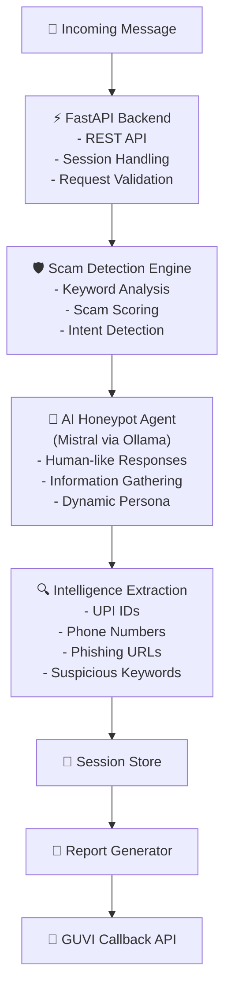

## Honeypot – AI-Powered Scam Detection & Intelligence Gathering System
Overview

Honeypot is an AI-driven cybersecurity solution designed to identify, engage, and analyze scam conversations in real time. The system acts as a simulated victim, interacts with suspected scammers using an AI-powered persona, collects actionable intelligence such as UPI IDs, phone numbers, and phishing links, and generates structured reports for security analysis.

Key Features
Real-time scam intent detection
AI-powered conversational engagement using Mistral LLM
Extraction of UPI IDs, phone numbers, and phishing links
Session-based conversation tracking
Automated scam confirmation through scoring mechanisms
Intelligent conversation termination
Automated incident reporting
RESTful API architecture using FastAPI
Tech Stack
Backend
Python
FastAPI
Pydantic
Uvicorn
AI & NLP
Mistral LLM
Ollama
Security & Intelligence Extraction
Regular Expressions (Regex)
Scam Intent Scoring Engine
APIs & Integration
REST APIs
Callback Reporting System
Deployment
Render

## System Architecture

## Workflow
1.A message is received through the Honeypot API. 
2.The Scam Detection Engine evaluates the message using predefined scam indicators. 
3.A scam score is calculated. 
4.If the score exceeds the threshold, the scam is confirmed. 
5.The AI-powered Honeypot Persona engages the scammer naturally. 
6.Intelligence such as UPI IDs, phone numbers, and phishing URLs is extracted. 
7.The system monitors conversation progress and determines when sufficient intelligence has been collected. 
8.The conversation is terminated automatically. 
9.A final intelligence report is generated and sent to the reporting endpoint. 

## API Endpoint
## POST /api/honeypot/message

Receives incoming messages and generates an appropriate response.

## Request Headers
X-API-Key: your_api_key
## Sample Response
{
  "status": "success",
  "reply": "Generated AI response"
}

## Future Enhancements
1.Machine Learning-based scam classification
2.Multi-language support
3.Dashboard for live monitoring
4.Advanced phishing detection
5.Fraud pattern analytics
6.Real-time threat intelligence integration
